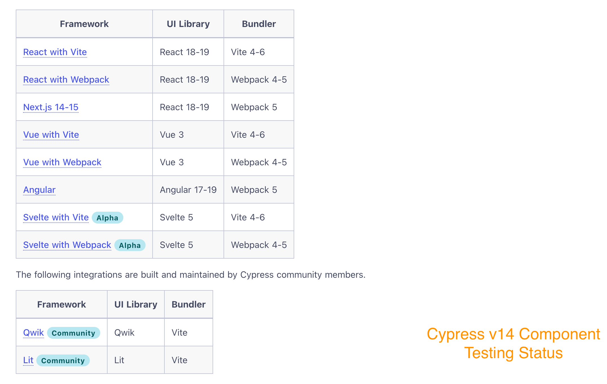
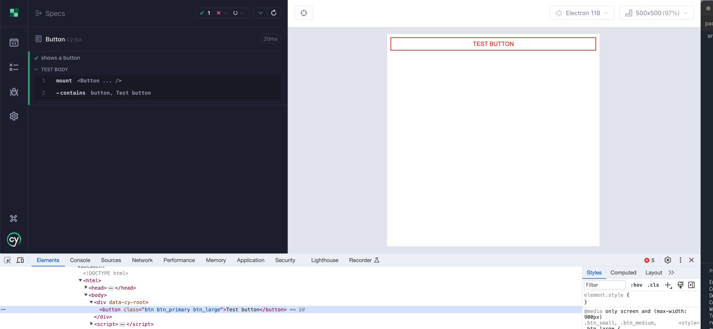
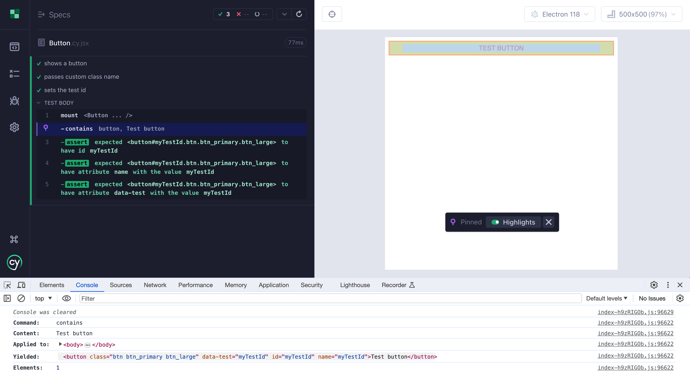
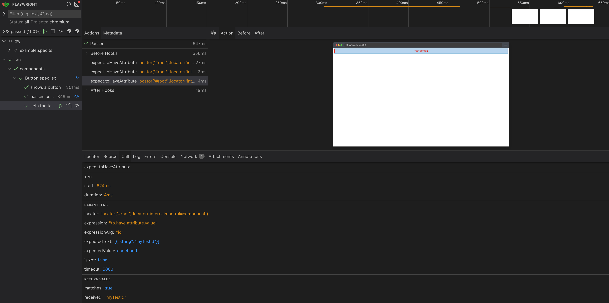
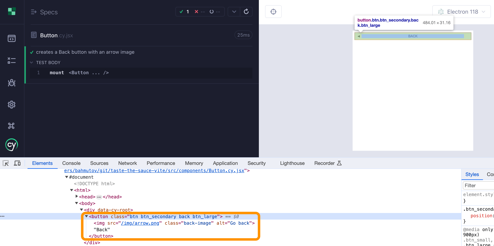
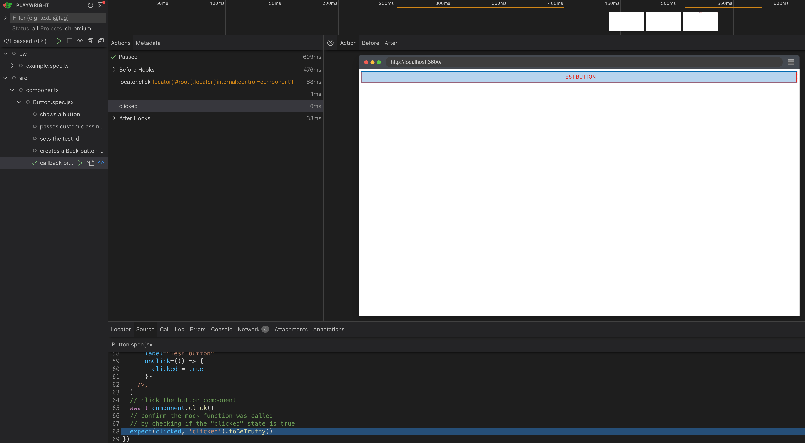
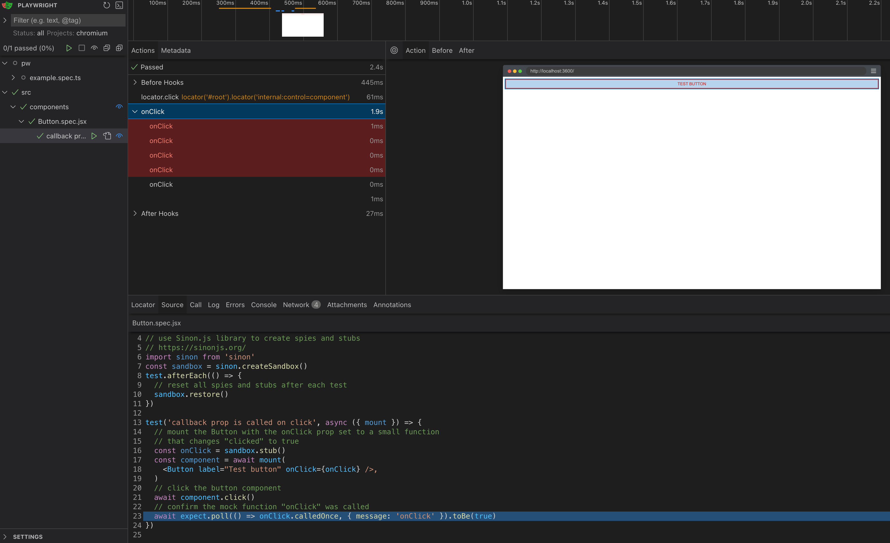
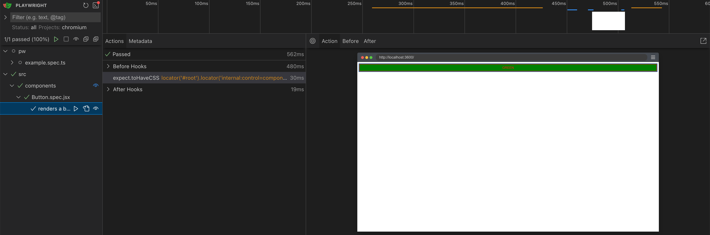
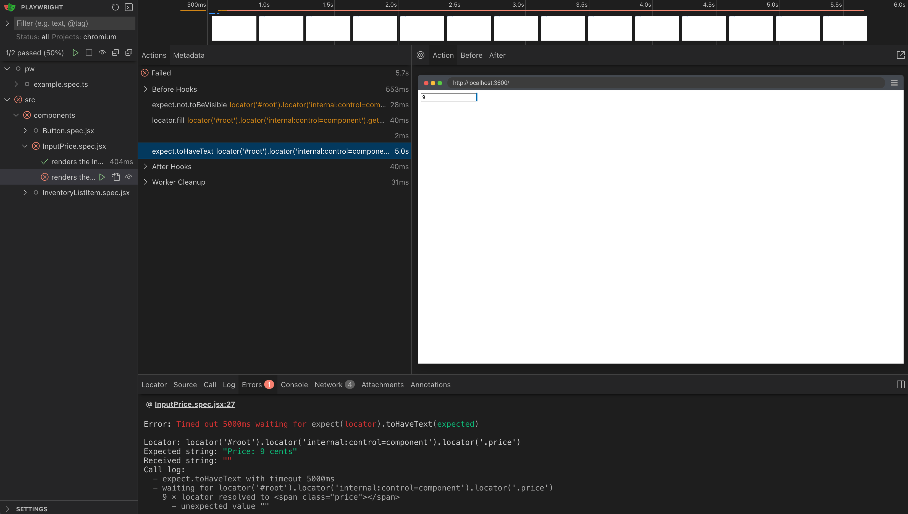

## Component Tests

### 📚 You will learn

- why component testing
- Cypress native component testing
- Playwright "bridge" component testing

---

## Component testing

- [https://on.cypress.io/component](https://on.cypress.io/component)
  - [https://glebbahmutov.com/blog/how-cypress-component-testing-was-born/](https://glebbahmutov.com/blog/how-cypress-component-testing-was-born/)
- [https://playwright.dev/docs/test-components](https://playwright.dev/docs/test-components)

+++

## Playwright status

- `@playwright/experimental-ct-react`
- `@playwright/experimental-ct-svelte`
- `@playwright/experimental-ct-vue`

+++



---

## Button component

```jsx
const Button = ({ customClass, label, onClick }) => {
  return (
    <button
      className={`btn${buttonTypeClass}${buttonSize}${extraClass}`}
      onClick={onClick}
    >
      ...
    </button>
  )
}
```

How would you test all possible behaviors of this button?

+++

```jsx
const Button = ({ customClass, label, onClick }) => {
```

Testing such button through E2E is hard, since the pages might only use a limited number of button's features.

Component tests to the rescue!<!-- .element: class="fragment" -->

+++

## Component tests

- small tests mounting a single front-end component (React, Vue, Angular, Svelte, etc)
- interacting with the "live" component
- checking the expected results:
  - DOM changes
  - network calls
  - prop callbacks

+++

## E2E vs Component Tests

- slow vs fast
- user story vs component
- web app vs component

---

## Example

- clone repo `https://github.com/bahmutov/taste-the-sauce-vite`
- check out branch `g1`
- `npm install`
- `npx playwright install`

---

## Todo: Write Cypress component test

```js
// src/components/Button.cy.jsx

import React from 'react'
import Button from './Button'

it('shows a button', () => {
  // use the cy.mount command to mount the Button component
  // with the prop `label` set to 'Test button'
  // confirm the page contains a button with the text 'Test button'
})
```

**Tip:** run Cypress in the component mode `npx cypress open --component`

**Tip 2:** look at the component support file `cypress/support/component.jsx`

+++

```js
// src/components/Button.cy.jsx

import React from 'react'
import Button from './Button'

it('shows a button', () => {
  // use the cy.mount command to mount the Button component
  // with the prop `label` set to 'Test button'
  cy.mount(<Button label="Test button" />)
  // confirm the page contains a button with the text 'Test button'
  cy.contains('button', 'Test button')
})
```

+++


+++



---

## Todo: Write Playwright component test

```js
// src/components/Button.spec.jsx

import { test, expect } from '@playwright/experimental-ct-react17'
import Button from './Button'

test('shows a button', async ({ mount }) => {
  // use the mount command to mount the Button component
  // with the prop `label` set to 'Test button'
  // confirm the component contains text 'Test button'
})
```

**Tip:** run the component spec in UI mode with `npm run test-ct -- --ui`. **Important ⚠️**: the `ctPort` in the Pw config must point at an unused port.

+++

```js
// src/components/Button.spec.jsx

import { test, expect } from '@playwright/experimental-ct-react17'
import Button from './Button'

test('shows a button', async ({ mount }) => {
  // use the mount command to mount the Button component
  // with the prop `label` set to 'Test button'
  const component = await mount(<Button label="Test button" />)
  // confirm the component contains text 'Test button'
  await expect(component).toContainText('Test button')
})
```

+++


---

## TODO: test other props

```js
// src/components/Button.cy.jsx

it('passes custom class name', () => {
  // mount the Button with the customClass prop set to "myClass"
  // confirm the page contains a button with the class "myClass"
})

it('sets the test id', () => {
  // mount the Button with the testId prop set to "myTestId"
  // confirm the button with the text "Test button" has
  // the data-test, name, and id set to "myTestId"
})
```

+++

```js
// src/components/Button.cy.jsx
it('passes custom class name', () => {
  cy.mount(<Button label="Test button" customClass="myClass" />)
  cy.get('button.myClass')
})

it('sets the test id', () => {
  cy.mount(<Button label="Test button" testId="myTestId" />)
  cy.contains('button', 'Test button')
    .should('have.id', 'myTestId')
    .and('have.attr', 'name', 'myTestId')
    .and('have.attr', 'data-test', 'myTestId')
})
```

+++



+++

```js
// src/components/Button.spec.jsx

test('passes custom class name', async ({ mount }) => {
  // mount the Button with the customClass prop set to "myClass"
  // confirm the page contains a button with the class "myClass"
})

test('sets the test id', async ({ mount }) => {
  // mount the Button with the testId prop set to "myTestId"
  // confirm the button with the text "Test button" has
  // the data-test, name, and id set to "myTestId"
})
```

+++

```js
// src/components/Button.spec.jsx

test('passes custom class name', async ({ mount }) => {
  const component = await mount(
    <Button label="Test button" customClass="myClass" />
  )
  await expect(component).toHaveClass(/myClass/)
})

test('sets the test id', async ({ mount }) => {
  const component = await mount(
    <Button label="Test button" testId="myTestId" />
  )
  await expect(component).toHaveAttribute('data-test', 'myTestId')
  await expect(component).toHaveAttribute('name', 'myTestId')
  await expect(component).toHaveAttribute('id', 'myTestId')
})
```

+++



---

## Config differences for component testing

Cypress has a single config for both E2E and component testing

```js
// cypress.config.js
import { defineConfig } from 'cypress'
export default defineConfig({
  e2e: {},
  component: {}
})
```

+++

Playwright has separate configs and test syntax

```js
// Playwright e2e config file
import { defineConfig, devices } from '@playwright/test'
// Playwright component config file
import { defineConfig, devices } from '@playwright/experimental-ct-react17'
```

+++

Playwright provides different `test` and `expect` for component testing

```js
// Playwright E2E specs
import { test, expect } from '@playwright/test'
// Playwright component spec
import { test, expect } from '@playwright/experimental-ct-react17'
```

---

## Use constants

- `git checkout g2`
- `npm install && npx playwright install`

Finish this Cypress component test

```js
// src/components/Button.cy.jsx
it('creates a Back button with an arrow image', () => {
  // mount the Button with the type prop set to "back"
  //
  // confirm that inside the button element with class "btn"
  // there is an image with alt text "Go back"
  // and the image loads its source without errors
})
```

+++

**Tip:** look at the image element's properties in the DevTools to check if it successfully loads (network, decoding, rendering)

+++



+++

## Cypress component test

```js
import Button from './Button'
import { BUTTON_TYPES } from './Button'
it('creates a Back button with an arrow image', () => {
  // mount the Button with the type prop set to "back"
  cy.mount(<Button label="Back" type={BUTTON_TYPES.BACK} />)
  // confirm that inside the button element with class "btn"
  // there is an image with alt text "Go back"
  // and the image loads its source without errors
  cy.get('button.btn')
    .find('img[alt="Go back"]')
    .should('have.prop', 'naturalWidth')
    .should('be.greaterThan', 0)
})
```

+++


---

## Use constants

Finish this Playwright component test

```js
// src/components/Button.spec.jsx
import { test, expect } from '@playwright/experimental-ct-react17'
import Button from './Button'
test('creates a Back button with an arrow image', async ({ mount }) => {
  // mount the Button with the type prop set to "back"
  // confirm that inside the button element with class "btn"
  // there is an image with alt text "Go back"
  // and the image loads its source without errors
})
```

+++

```js
test('creates a Back button with an arrow image', async ({ mount }) => {
  const component = await mount(
    <Button label="Back" type={BUTTON_TYPES.BACK} />
  )
  const image = component.locator('img[alt="Go back"]')
  await expect(async () => {
    const width = await image.evaluate((node) => node.naturalWidth)
    expect(width, 'image width').toBeGreaterThan(0)
  }).toPass()
  // this solution could also work in this case
  await expect(image).not.toHaveJSProperty('naturalWidth', 0)
})
```

+++


+++

## Questions:

- what do you see when you run Cypress component test?
- what do you see when you run Playwright component test?

---

## Passing functional props

```js
const Button = ({
  customClass,
  label,
  onClick,
}) => {
  return (
    <button
      className={`btn${buttonTypeClass}${buttonSize}${extraClass}`}
      onClick={onClick}
```

Let's test the `onClick` prop when the user clicks the button.

+++

## Finish the Playwright test

- branch `g3`
- `npm install && npx playwright install`

```js
// src/components/Button.spec.jsx
test('callback prop is called on click', async ({ mount }) => {
  // keep track of the clicked state
  let clicked = false
  // mount the Button with the onClick prop set to a small function
  // that changes "clicked" to true
  //
  // click the button component
  // confirm the mock function was called
  // by checking if the "clicked" state is true
})
```

**Question:** what do you see during the test?

+++

```js
// src/components/Button.spec.jsx
test('callback prop is called on click', async ({ mount }) => {
  let clicked = false
  const component = await mount(
    <Button
      label="Test button"
      onClick={() => {
        clicked = true
      }}
    />
  )
  await component.click()
  expect(clicked, 'clicked').toBeTruthy()
})
```

+++



+++

## Finish the Cypress test

```js
// src/components/Button.cy.jsx
it('callback prop is called on click', () => {
  // mount the Button with the onClick function stub
  // https://on.cypress.io/stub
  // give the stub an alias "onClick"
  // https://on.cypress.io/as
  //
  // click the button component
  //
  // confirm the stub function was called
})
```

+++

```js
// src/components/Button.cy.jsx
it('callback prop is called on click', () => {
  cy.mount(<Button label="Test button" onClick={cy.stub().as('onClick')} />)
  cy.get('button').click()
  cy.get('@onClick').should('have.been.calledOnce')
})
```

+++


---

## Async functional props

What if the component calls the functional prop `onClick` after some delay?

```js
// Instead of this
<button onClick={onClick}>
// We have an async call
onClick={() => setTimeout(onClick, 1000)}
```

+++

- check out branch `g4`
- `npm install`
- `npx playwright install`

Open test runners in the component testing modes; the `Button.jsx` component calls `onClick` after 1-second delay.

+++

## Modify Cypress test

```js
// src/components/Button.cy.jsx
it('callback prop is called on click', () => {
  // mount the Button with the onClick function stub
  // https://on.cypress.io/stub
  // give the stub an alias "onClick"
  // https://on.cypress.io/as
  cy.mount(<Button label="Test button" onClick={cy.stub().as('onClick')} />)
  // click the button component
  cy.get('button').click()
  // confirm the stub function was called
  cy.get('@onClick').should('have.been.calledOnce')
})
```

+++

**Cypress solution:** no changes necessary.

Note:
The assertion `cy.get('@onClick').should('have.been.calledOnce')` already retries until the stub function is called.

+++


+++

## Modify Playwright test

```js
// src/components/Button.spec.jsx
test('callback prop is called on click', async ({ mount }) => {
  let clicked = false
  const component = await mount(
    <Button
      label="Test button"
      onClick={() => {
        clicked = true
      }}
    />
  )
  await component.click()
  expect(clicked, 'clicked').toBeTruthy()
})
```

**Tip:** look at auto-retrying assertions in Playwright docs https://playwright.dev/docs/test-assertions#auto-retrying-assertions

+++

You must make the assertion `expect(clicked, 'clicked').toBeTruthy()` retry

```js
await expect
  .poll(
    () => {
      return clicked
    },
    { message: 'clicked' }
  )
  .toBeTruthy()
```

+++


---

## Using Sinon.js library with Playwright

Let's add a powerful library for functional spies and stubs to make Playwright component tests easy to write.

- check out branch `g5`
- `npm install`
- `npx playwright install`

The dependencies include the `sinon` library

+++

## Use Sinon with Playwright

```js
// use Sinon.js library to create spies and stubs
// https://sinonjs.org/
import sinon from 'sinon'
const sandbox = sinon.createSandbox()
test.afterEach(() => {
  // reset all spies and stubs after each test
  sandbox.restore()
})
```

+++

Finish the test

```js
// src/components/Button.spec.jsx
test('callback prop is called on click', async ({ mount }) => {
  // mount the Button with the onClick prop set to a small function
  // that changes "clicked" to true
  // Tip: create the onClick function stub using the Sinon sandbox
  // click the button component
  // confirm the mock function "onClick" was called
})
```

+++

```js
// src/components/Button.spec.jsx
test('callback prop is called on click', async ({ mount }) => {
  // mount the Button with the onClick prop set to a small function
  // that changes "clicked" to true
  const onClick = sandbox.stub()
  const component = await mount(
    <Button label="Test button" onClick={onClick} />
  )
  // click the button component
  await component.click()
  // confirm the mock function "onClick" was called
  await expect.poll(() => onClick.calledOnce, { message: 'onClick' }).toBe(true)
})
```

+++



+++

## Check call arguments

```js
test('callback prop is called with arguments', async ({ mount }) => {
  // the Button component calls the "onClick" prop with a string
  // confirm the correct string is passed when the button is clicked
  // Tip: use the "stub.calledOnceWithExactly" method to check
})
```

+++

```js
test('callback prop is called with arguments', async ({ mount }) => {
  // the Button component calls the "onClick" prop with a string
  // confirm the correct string is passed when the button is clicked
  // Tip: use the "stub.calledOnceWithExactly" method to check
  const onClick = sandbox.stub()
  const component = await mount(
    <Button label="Test button" onClick={onClick} />
  )
  await component.click()
  await expect
    .poll(() => onClick.calledOnceWithExactly('Hello from button'), {
      message: 'onClick'
    })
    .toBe(true)
})
```

+++

## Compare solutions

```js
// Cypress
cy.mount(<Button label="Test button" onClick={cy.stub().as('onClick')} />)
cy.get('button').click()
cy.get('@onClick').should(
  'have.been.calledOnceWithExactly',
  'Hello from button'
)
// Playwright
const onClick = sandbox.stub()
const component = await mount(<Button label="Test button" onClick={onClick} />)
await component.click()
await expect
  .poll(() => onClick.calledOnceWithExactly('Hello from button'), {
    message: 'onClick'
  })
  .toBe(true)
```

---

## Component test page

Each test component is mounted on a special page

- CY `cypress/support/component-index.html`
- PW `playwright/index.html`

Let's modify it: use branch `g6`

+++

## Cy: Green button

```js
// src/components/Button.cy.jsx
it('renders a button on green background', () => {
  cy.mount(<Button label="Green" />)
  // confirm the button has a green assertion
  // Tip: use the "have.css" Chai-jQuery assertion
  // https://www.chaijs.com/plugins/chai-jquery/
})
```

**Tip:** modify the style in `cypress/support/component-index.html`

+++


+++

```js
// src/components/Button.cy.jsx

it('renders a button on green background', () => {
  cy.mount(<Button label="Green" />)
  // confirm the button has a green assertion
  // Tip: use the "have.css" Chai-jQuery assertion
  // https://www.chaijs.com/plugins/chai-jquery/
  cy.get('button').should('have.css', 'background-color', 'rgb(0, 128, 0)')
})
```

+++

## Pw: Green button

```js
// src/components/Button.spec.jsx

test('renders a button on green background', async ({ mount }) => {
  const component = await mount(<Button label="Green" />)
  // confirm the button has a green background
  // Tip: use "toHaveCSS" assertion
  // https://playwright.dev/docs/api/class-locatorassertions
})
```

**Tip:** add style to the file `playwright/index.html`

+++

```js
// src/components/Button.spec.jsx

test('renders a button on green background', async ({ mount }) => {
  const component = await mount(<Button label="Green" />)
  // confirm the button has a green background
  // Tip: use "toHaveCSS" assertion
  // https://playwright.dev/docs/api/class-locatorassertions
  await expect(component).toHaveCSS('background-color', 'rgb(0, 128, 0)')
})
```

+++



---

## Component scaffolding

- clone repo `https://github.com/bahmutov/taste-the-sauce-vite`
- check out branch `g7`
- `npm install`
- `npx playwright install`

+++

## Try testing `InventoryListItem`

```js
// src/components/InventoryListItem.cy.jsx

describe('InventoryListItem', () => {
  // shows the failure when we try mounting a component
  // that expects to be inside a router
  it('tries to load one item', () => {
    const item = InventoryData[3]
    cy.mount(<InventoryListItem {...item} />)
  })
})
```

+++


+++

**TODO:** mount component inside the router

```js
it('loads one item (with router)', () => {
  // take one of the items loaded from the inventory data list
  // and mount the "InventoryListItem" component
  // inside a router
  // <BrowserRouter initialEntries={[]}><Route>...</Route></BrowserRouter>
  const item = InventoryData[3]
  // assert that the item's name is there
  cy.contains('.inventory_item_name', item.name)
})
```

+++

```js
it('loads one item (with router)', () => {
  const item = InventoryData[3]
  cy.mount(
    <BrowserRouter initialEntries={[]}>
      <Route>
        <InventoryListItem {...item} />
      </Route>
    </BrowserRouter>
  )
  cy.contains('.inventory_item_name', item.name)
})
```

+++


+++

## Todo: Simply the test

Instead of global `cy.mount` command use `cy.mountWithRouter` from `cypress/support/component.jsx`

```js
Cypress.Commands.add('mountWithRouter', (Component) => {
  return mount(
    <BrowserRouter initialEntries={[]}>
      <Route>{Component}</Route>
    </BrowserRouter>
  )
})
```

Update your test to use `cy.mountWithRouter`

+++

```js
// src/components/InventoryListItem.cy.jsx

it('loads one item', () => {
  const item = InventoryData[3]
  cy.mountWithRouter(<InventoryListItem {...item} />)
  cy.contains('.inventory_item_name', item.name)
})
```

+++

## Playwright mount

```js
// src/components/InventoryListItem.spec.jsx
test('InventoryListItem loads one item', async ({ mount }) => {
  // take one of the items loaded from the inventory data list
  // and mount the "InventoryListItem" component
  // inside a router
  // <BrowserRouter initialEntries={[]}><Route>...</Route></BrowserRouter>
  const item = InventoryData[3]
  // assert the component is visible
  // assert that the item's name is there
})
```

+++

```js
test('InventoryListItem loads one item', async ({ mount }) => {
  const item = InventoryData[3]
  const component = await mount(
    <BrowserRouter initialEntries={[]}>
      <Route>
        <InventoryListItem {...item} />
      </Route>
    </BrowserRouter>
  )
  await expect(component).toBeVisible()
  await expect(component.locator('.inventory_item_name')).toHaveText(item.name)
})
```

+++


+++

**Todo:** use helper function to mount inside a Router

```js
// Helper function to mount the component inside a router
// to avoid repeating the router setup in each test
// Note: in the real application, you probably would use Playwright Test Fixtures
// https://playwright.dev/docs/test-fixtures
function mountWithRouter(mountFn, component) {}

test('InventoryListItem loads one item (mount helper)', async ({ mount }) => {
  // rewrite the above test to use the "mountWithRouter" helper function
  // to avoid repeating the router setup
  const item = InventoryData[3]
  // confirm the component is visible
  // and has the correct item name
})
```

+++

```js
function mountWithRouter(mountFn, component) {
  return mountFn(
    <BrowserRouter initialEntries={[]}>
      <Route>{component}</Route>
    </BrowserRouter>
  )
}

test('InventoryListItem loads one item (mount helper)', async ({ mount }) => {
  const item = InventoryData[3]
  const component = await mountWithRouter(
    mount,
    <InventoryListItem {...item} />
  )
  await expect(component).toBeVisible()
  await expect(component.locator('.inventory_item_name')).toHaveText(item.name)
})
```

**Tip:** for a better way of doing this see [Pw Test fixtures](https://playwright.dev/docs/test-fixtures)

---

## Communication between the component and the test

- clone repo `https://github.com/bahmutov/taste-the-sauce-vite`
- check out branch `g8`
- `npm install`
- `npx playwright install`

+++

## Price format component

```js
// src/components/InputPrice.jsx
const InputPrice = ({ priceFormatter }) => {
  const formatter = priceFormatter || defaultPriceFormatter
  const [price, setPrice] = useState()

  return (
    <div className="input-price">
      <input
        type="text"
        value={price}
        onChange={(e) => setPrice(e.target.value)}
        placeholder="Enter price (cents)"
      />{' '}
      {!isNaN(price) && <span className="price">{formatter(price)}</span>}
    </div>
  )
}

export default InputPrice
```

+++

## Cypress: test the default format function

```js
// src/components/InputPrice.cy.jsx
it('renders the InputPrice component', () => {
  // mount the component using the default price formatter
  cy.mount(<InputPrice />)
  // initially the formatted price is not displayed
  cy.get('.price').should('not.exist')
  // type the "9" and confirm the formatted price is "$0.09"
  cy.get('[placeholder="Enter price (cents)"]').type('9')
  cy.get('.price').should('be.visible').and('have.text', '$0.09')
  // type another "9" and confirm the formatted price is "$0.99"
  cy.get('[placeholder="Enter price (cents)"]').type('9')
  cy.get('.price').should('have.text', '$0.99')
})
```

The test is working.

+++

## Finish the second test

Test the custom format function

```js
it('renders the InputPrice component with custom formatter', () => {
  const customFormatter = (price) => `Price: ${price} cents`
  // mount the component with a custom format function above
  // follow the test above and check if the formatted price is displayed
})
```

+++

## Cypress solution

```js
it('renders the InputPrice component with custom formatter', () => {
  const customFormatter = (price) => `Price: ${price} cents`
  // mount the component with a custom format function above
  // follow the test above and check if the formatted price is displayed
  cy.mount(<InputPrice priceFormatter={customFormatter} />)
  cy.get('.price').should('not.exist')
  cy.get('[placeholder="Enter price (cents)"]').type('9')
  cy.get('.price').should('be.visible').and('have.text', 'Price: 9 cents')
  cy.get('[placeholder="Enter price (cents)"]').type('9')
  cy.get('.price').should('have.text', 'Price: 99 cents')
})
```

+++


+++

## Playwright: test the default format function

```js
// src/components/InputPrice.spec.jsx
test('renders the InputPrice component', async ({ mount }) => {
  // mount the component using the default price formatter
  const component = await mount(<InputPrice />)
  // initially the formatted price is not displayed
  await expect(component.locator('.price')).not.toBeVisible()
  // type the "9" and confirm the formatted price is "$0.09"
  await component.getByPlaceholder('Enter price (cents)').fill('9')
  await expect(component.locator('.price')).toHaveText('$0.09')
  // type another "9" and confirm the formatted price is "$0.99"
  await component.getByPlaceholder('Enter price (cents)').fill('99')
  await expect(component.locator('.price')).toHaveText('$0.99')
})
```

+++

## Todo: finish testing the custom format function

```js
test('renders the InputPrice component with custom formatter', async ({
  mount
}) => {
  const customFormatter = (price) => `Price: ${price} cents`
  // mount the component with a custom format function above
  // follow the test above and check if the formatted price is displayed
})
```

+++

## Solution attempt

```js
test('renders the InputPrice component with custom formatter', async ({
  mount
}) => {
  const customFormatter = (price) => `Price: ${price} cents`
  // mount the component with a custom format function above
  // follow the test above and check if the formatted price is displayed
  const component = await mount(<InputPrice priceFormatter={customFormatter} />)
  await expect(component.locator('.price')).not.toBeVisible()

  await component.getByPlaceholder('Enter price (cents)').fill('9')
  await expect(component.locator('.price')).toHaveText('Price: 9 cents')
  await component.getByPlaceholder('Enter price (cents)').fill('99')
  await expect(component.locator('.price')).toHaveText('Price: 99 cents')
})
```

+++



+++

## Pw component <-> test communication

Pw has to switch every synchronous call to a Promise-returning call to communicate between the browser (component) and spec (Node)

```html
<!-- normal component execution in the browser: formatter is in the browser -->
<span className="price">{formatter(price) // yields a string}</span>
<!-- playwright test execution: formatter is in the spec file -->
<span className="price">{formatter(price) // yields Promise<string>}</span>
```

---

## 🏁 Conclusions

- Cypress can run component tests the same way as its regular E2E tests
- Playwright creates a separate page with the component and "bridges" spec code to interact with the component <!-- .element: class="fragment" -->
- Cypress has functional assertions <!-- .element: class="fragment" -->
- Cypress interacts much more directly with the component <!-- .element: class="fragment" -->

➡️ Go to the [end](?p=end) chapter

+++


Learn more: 📺 "Component Testing With Murat Ozcan: Cy vs Pw vs Vitest" [https://youtu.be/SPSLeGUpdYA](https://youtu.be/SPSLeGUpdYA)

+++

## Write E2E + Component tests

using Cypress and / or Playwright

```text
# E2E candidates               # Component test candidates
Cart                           src/pages/InventoryItem.jsx
  - items added, deleted         - shows item details
Cart page                        - adds an item to the cart
  - zero items                   - stores the cart in the local storage
  - several items                - handles non-existent item
  - navigates to the item      src/components/InventoryListItem.jsx
Checkout flow                    - adds an item to the cart
  - buy an item                src/components/ErrorMessage.jsx
Inventory page                   - shows an error message
  - has all the items            - reacts to the user click
  - navigation                 src/utils/Sorting.js
  - sorting                      - unit tests for the sorting functions
```
